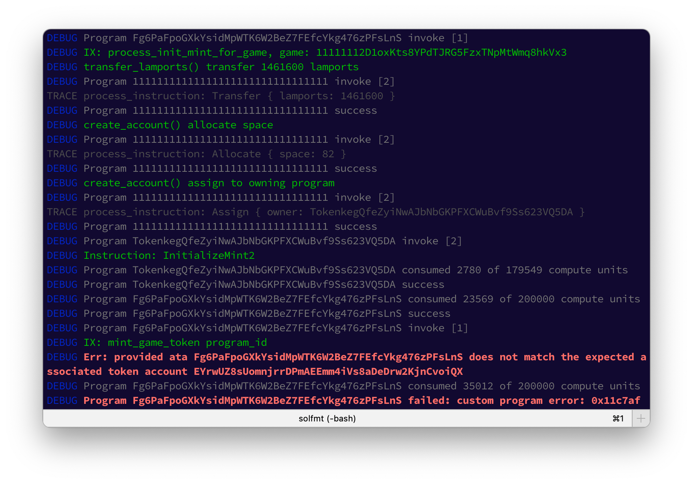
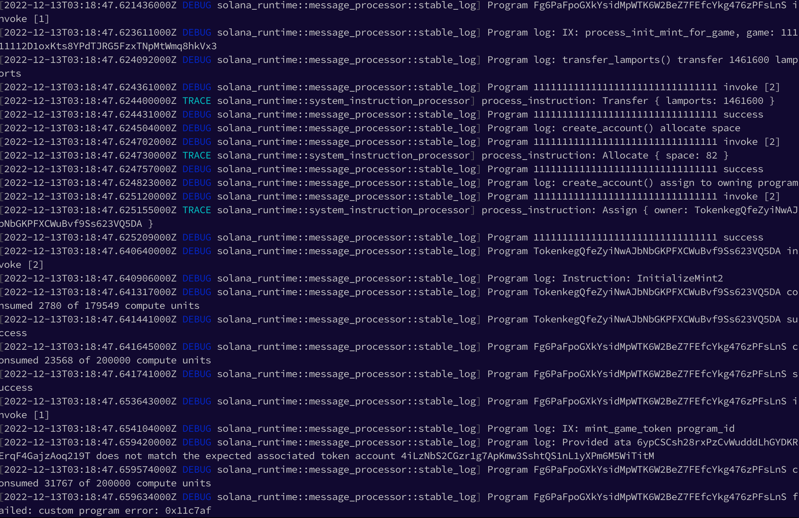

# solfmt

Formats output of Solana's `cargo test-bpf/test-sbf` command.

## Installation

```sh
cargo install solfmt
```

## Usage

1. Run the your test command as usual
2. Pipe `stderr` into `stdout` 
3. Pipe the result to `solfmt`

```sh
cargo test-sbf -- --test-threads=1 2>&1 | solfmt
```

4. Enjoy more readable logs



### Same logs without solfmt




## LICENSE

MIT
