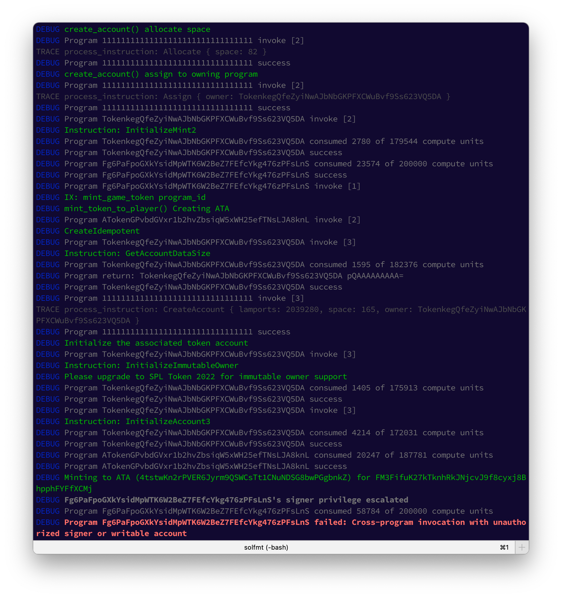

# solfmt

Formats output of Solana's `cargo test-bpf/test-sbf` command.



## Installation

```sh
cargo install solfmt
```

## Usage

1. Run the your test command as usual (`cargo test-sbf -- --test-threads=1`)
2. Pipe `stderr` into `stdout` (`2>&1`)
3. Pipe the result to `solfmt` (`| sofmt`)

```sh
cargo test-sbf -- --test-threads=1 2>&1 | solfmt
```

4. Enjoy more readable logs

## Preserving Colorful Build Output

Since we're piping the output of `cargo test-sbf` into _solfmt_ it doesn't print in colors by
default. 

We can fix that by setting the `CARGO_TERM_COLOR` env var appropriately.

```sh
CARGO_TERM_COLOR=always cargo test-sbf -- --nocapture --test-threads=1 2>&1 | solfmt
```

Since this is a lot to type you should add a reusable function to your bashrc. 

The below [defined in my
dotfiles](https://github.com/thlorenz/dotfiles/blob/ab362381b8e9b9d7ee7e0b71ae590cc14b88f879/bash/rust-aliases.sh#L29-L32)
allows to focus on a simple test as well by providing it as an argument.

```sh
function cg-tsbf() {
  clear; 
  CARGO_TERM_COLOR=always cargo test-sbf $1 -- --nocapture --test-threads=1 2>&1 | solfmt
}
```

## LICENSE

MIT
